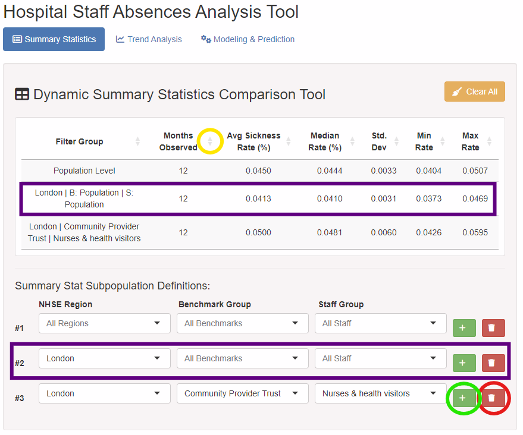
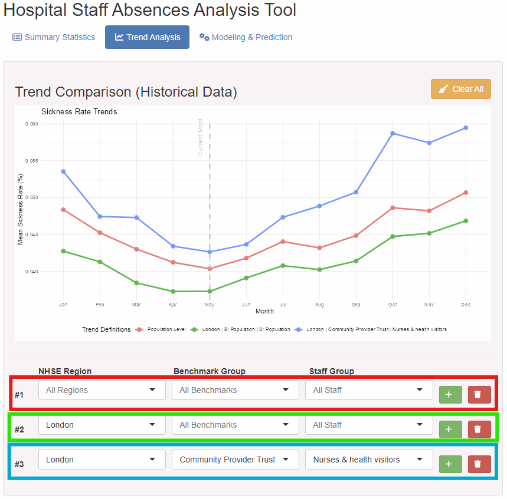
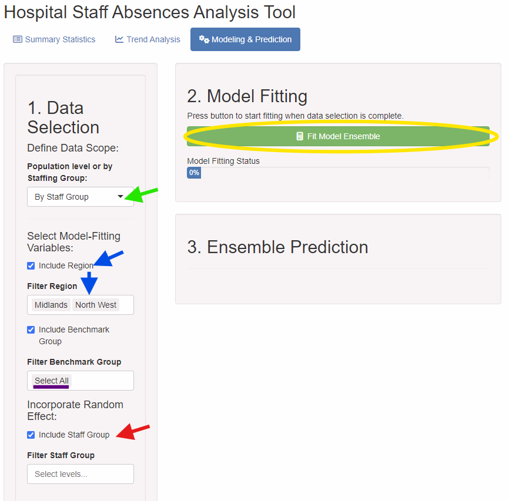
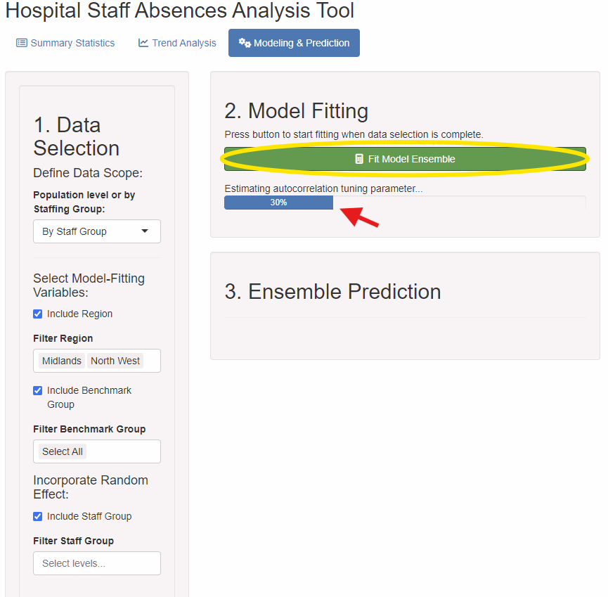
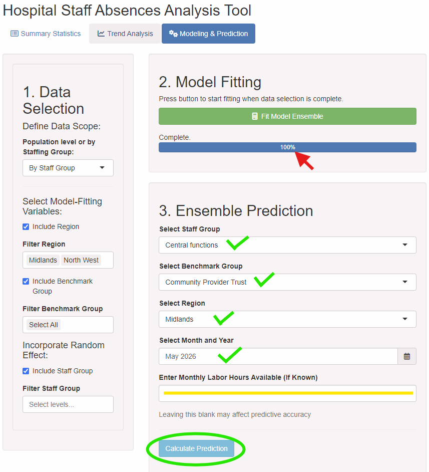
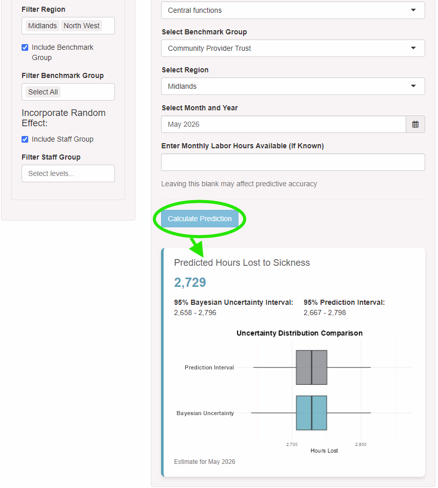

```{r, include = FALSE}
knitr::opts_chunk$set(
  collapse = TRUE,
  comment = "#>"
)
```

``` r
if (!requireNamespace("remotes", quietly = TRUE)) install.packages("remotes")
remotes::install_github("nbird5560-hue/HospitalAbsences)

library(HospitalAbsences)
run_app()
```

## Summary Statistics Tool
Upon starting the app, you will be met with the \strong{Dynamic Summary Statistics Comparison Tool}.  In the example image below, the purple boxes identify a pair of corresponding input and output rows. Data selection is made with the drop-down boxes in the bottom purple box, and the summary statistics reflecting that data slice and displayed in the top purple box. Also note the green and red circles in the bottom right corner, which highlight the add row and delete row icons respectively.  The yellow circle at the top center of the image indicates the buttons for reordering the dynamic table by value of the associated metric. Lastly, the yellow-orange button in the top right corner can be used to reset all rows in the dynamic table.



## Trend Analysis Tool

We see a similar UI in the \strong{Trend Analysis Tool} page. The same system for creating data slices for comparison is implemented here; see the correspondingly-colored boxes referencing the trend lines on the graph.  We can use this tool to visually compare trends in sickness rate between different subpopulations across a calendar year. 




## Modeling & Prediction Tool
### 1. Data Selection

The \strong{Modeling & Prediction Tool} is the most complicated of the tools to use, and its submodules must be performed in sequence.



In the above image, the green arrow indicates the selection box where we can select the scope of the data as either being partitioned by staff group, or as being blind to differences in staff group.  The red arrow indicates the variable inclusion checkbox for staff group, which is only available when the scope of the data is set to "By Staff Group". The blue arrows show the variable inclusion box for the optional predictor `Region`, and the drop down box which allows the user to filter factors for specific levels.  In the case of `Region`, only levels for "Midlands" and "North West" are kept.  Unfiltered factors retain all levels, as indicated by the "Select All" option underlined in purple below.  The yellow circle indicates the next submodule to be used.


### 2. Model Fitting
When you feel satisfied with your data filtration, press the circled yellow button labeled \emph{"Fit Model Ensemble"} in the second submodule. This will initiate ensemble fitting on your GAM(M)s.  This submodule's process completion can be tracked by the progress bar indicated by the red arrow in the image below.





### 3.1. Ensemble Prediction
Once your ensemble has finished training, we will be alerted by the progress bar in \strong{Panel 2} being complete.  Then, we can enter data for the group we would like to predict in the selection boxes in \strong{Panel 3}. All selection boxes with green checkmarks next to them must be filled before a prediction can be made.  However, the `hours_available` numeric input struck-through by a yellow line may be left blank if the total hours available for that grouping is unknown.  When you have selected your subpopulation of choice, press the button circled in green that says "Calculate Prediction". 




### 3.2. Prediction Results
Once the "Calculate Prediction" button is pressed, the ensembles will bag predictions for `hours_lost` and produce a point estimate, a 95% Bayesian Uncertainty Interval, and a 95% Prediction Interval, as well as comparative boxplots for the distributions of those metrics. \strong{Panel 3} expands to accommodate these predictions, as indicated by the image below.



## Finishing up
The app may be terminated at any time by stopping the R process with q(), by stopping the console manually in an IDE, or by simply closing the user's R session. parallel processors will automatically be terminated.
